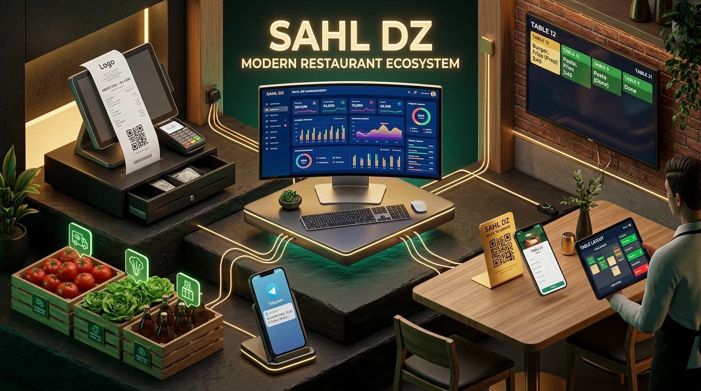

# منصة سهل (Sahl DZ) — الدليل الشامل لخدمات وحلول إدارة المطاعم

> **نظام سحابي ومكتبي متكامل (All-in-One SaaS & On-Premise Hybrid) صُمم خصيصاً لإدارة المطاعم، المقاهي، محلات الوجبات السريعة، وصالات الضيافة في الجزائر والعالم العربي.**



---

## 📌 الفهرس السريع

1. [نظرة عامة والقيمة المضافة](#-نظرة-عامة-والقيمة-المضافة)
2. [بيئة العمل والمنصات المدعومة (Cross-Platform)](#-بيئة-العمل-والمنصات-المدعومة-cross-platform)
3. [الأدوار والمستخدمون داخل المنظومة](#-الأدوار-والمستخدمون-داخل-المنظومة)
4. [الخدمات والوحدات الوظيفية التفصيلية](#-الخدمات-والوحدات-الوظيفية-التفصيلية)
   - [1. لوحة تحكم المالك والعمليات (Control Desk)](#1-لوحة-تحكم-المالك-والعمليات-restaurant-control-desk)
   - [2. نقاط البيع وشاشات التشغيل (POS & Operational Screens)](#2-نقاط-البيع-وشاشات-التشغيل-pos--operational-screens)
   - [3. منيو الـ QR الذكي وطلبات الطاولات الذاتية](#3-منيو-الـ-qr-الذكي-وطلبات-الطاولات-الذاتية)
   - [4. توجيه المطابخ وتذاكر الطباعة الصامتة (Kitchen Routing)](#4-توجيه-المطابخ-المتعددة-والطباعة-الصامتة-80mm)
   - [5. إدارة المخزون والموردين والهدر (Supply Chain & Waste)](#5-إدارة-المخزون-والموردين-وتتبع-الهدر)
   - [6. هندسة الوصفات والخصم الآلي للمواد (Recipe Costing & COGS)](#6-هندسة-الوصفات-وحساب-التكاليف-والخصم-الآلي)
   - [7. المحاسبة والأرباح والتقارير المالية (Accounting & P&L)](#7-المحاسبة-والأرباح-والخسائر-والتقارير-المالية)
   - [8. الموارد البشرية وصلاحيات الأمان بالـ PIN](#8-إدارة-الموظفين-والورديات-والدخول-السريع-بالـ-pin)
   - [9. التوصيل الخارجي وتيك أواي وبوت التيليجرام](#9-الطلبات-الخارجية-والتوصيل-وبوت-التيليجرام)
   - [10. أدوات الذكاء الاصطناعي (AI Menu Vision & Assistant)](#10-الذكاء-الاصطناعي-وقراءة-المنيو-بالرؤية-الحاسوبية)
5. [جدول قدرات النظام المخصص للذكاء الاصطناعي (AI Context Schema)](#-جدول-قدرات-النظام-المخصص-للذكاء-الاصطناعي-ai-context-schema)
6. [الروابط وقنوات التثبيت والتشغيل](#-الروابط-وقنوات-التثبيت-والتشغيل)

---

## 🌟 نظرة عامة والقيمة المضافة

يحل نظام **Sahl DZ** المعادلة الصعبة لأصحاب المطاعم: **الجمع بين مرونة السحابة وسرعة واستقرار الأنظمة المكتبية دون الحاجة إلى اشتراكات معقدة أو تجهيزات باهظة الثمن.**

### المشاكل التي يقضي عليها النظام:
- **ضياع الطلبات وبطء التواصل:** تحويل دورة الطلب من ورقية عشوائية إلى دورة رقمية لحظية (نادل ➔ مطبخ ➔ كاشير).
- **التسريب المالي وسرقة المخزون:** ربط كل طبق بجرام وسنتيمتر المكونات، وخصم المخزون آلياً مع كل طلب.
- **تشتت تذاكر الطهي في المطابخ الكبيرة:** توجيه تلقائي لكل صنف للمطبخ المختص به وطباعته صامتاً.
- **صعوبة معرفة الأرباح الحقيقية:** استخراج صافي الربح اليومي الحقيقي بعد احتساب تكلفة المواد، المصاريف اليومية، والهدر.

---

## 💻 بيئة العمل والمنصات المدعومة (Cross-Platform)

| المنصة | نوع التثبيت | الاستخدام الأمثل |
| :--- | :--- | :--- |
| **تطبيق سطح المكتب (Windows)** | ملف تنفيذي مستقل (`.exe`) | أجهزة الكاشير، طابعات الإيصالات الحرارية (80mm/58mm)، شاشات المطبخ، تسجيل دخول العمال بالـ PIN السريع دون كشف بيانات الحساب. |
| **تطبيق الويب السحابي (Web Cloud)** | رابط مباشر متجاوب (`sahldz.com`) | لوحة المالك والمدير العام لمتابعة النشاط من أي لابتوب أو حاسوب عن بُعد. |
| **تطبيق الهاتف (Android APK)** | ملف مباشر (`.apk`) | هاتف المالك أو المشرف لمتابعة الإشعارات الفورية للمبيعات وللطلبات الخارجية. |
| **تطبيق الويب التقدمي (PWA)** | تثبيت مباشر بنقرة واحدة من المتصفح | هواتف النوادل داخل الصالة أو الأجهزة اللوحية دون الحاجة لمتجر تطبيقات. |

---

## 👥 الأدوار والمستخدمون داخل المنظومة

1. **المالك / المدير العام (Admin / General Manager):**
   - تحكم كامل بجميع الفروع، العمليات، التقارير المالية، تعديل الأسعار، ومراقبة مؤشرات الأداء الحية.
2. **الكاشير (Cashier):**
   - تحصيل الحسابات، إصدار الفواتير وطباعتها، إدارة الخصومات، والبحث السريع عن الطاولات، واستخراج تقرير الإغلاق (Z-Report).
3. **النادل (Waiter):**
   - تسجيل طلبات الطاولات من شاشته أو هاتفه، استلام تنبيهات جاهزية الأطباق، وتسليمها للزبائن.
4. **رئيس المطبخ / الطباخ (Kitchen Staff / Chef):**
   - شاشة عرض طلبات تفاعلية (KDS) مقسمة حسب المحطات مع تنبيهات صوتية وإمكانية إعلام النادل بجاهزية الطبق بضغطة زر.
5. **مسؤولو العمليات التخصصية (Ops Leads):**
   - مسؤول المشتريات (الموردين والمخزون)، مسؤول الجودة والهدر، ومسؤول الموارد البشرية.

---

## 🚀 الخدمات والوحدات الوظيفية التفصيلية

### 1. لوحة تحكم المالك والعمليات (Restaurant Control Desk)
- **شريط مؤشرات لحظي متصل:** يوضح إجمالي مبيعات اليوم، صافي الأرباح اللحظي، عدد الطلبات، ومتوسط قيمة الفاتورة.
- **تحليل قنوات البيع الثلاثية:** فرز تلقائي لنسب وإيرادات: داخل الصالة (Dine-in)، الاستلام الشخصي (Takeaway)، وطلبات التوصيل (Delivery).
- **مركز التنبيهات الذكي:** إشعار المالك فوراً عند وصول مادة خام لحد الخطر، أو تسجيل هدر غير معتاد، أو تأخر طلبات في المطبخ.
- **تخصيص كامل للهوية:** رفع شعار المطعم، إعدادات الضرائب والعملة (دينار جزائري DZD)، ومعلومات السجل التجاري والعنوان.

### 2. نقاط البيع وشاشات التشغيل (POS & Operational Screens)
- **شاشة الكاشير السريعة:** تدعم شاشات اللمس مع واجهة بحث بالباركود، الاسم، أو الفئات.
- **شاشة المطبخ الذكية (KDS):** استبدال شاشات التذاكر الورقية بشاشة لوحية للمطبخ تفرز الطلبات بالأقدمية وحسب وقت التحضير مع تنبيه صوتي للطلبات المستعجلة.
- **شاشة النادل الميداني:** تتيح للنادل فتح طاولة، إضافة طلبات متعددة، تحويل الأصناف، ومتابعة حالة طاولاته بنظرة واحدة.
- **تقرير الإغلاق اليومي (Z-Report):** جرد كامل للمدفوعات النقدية، الإلغاءات، وتفاصيل المبيعات اليومية بنقرة واحدة قبل إغلاق الوردية.

### 3. منيو الـ QR الذكي وطلبات الطاولات الذاتية
- **توليد رموز QR لكل طاولة:** إمكانية تنزيل وطباعة أكواد QR لكل طاولة وقاعة.
- **طلب ذاتي كامل بدون انتظار:** يقوم الزبون بمسح الكود بكاميرا هاتفه، يفتح المنيو فوراً (سريع جداً وخفيف)، يختار الإضافات والملاحظات، ويرسل الطلب مباشرة للمطبخ.
- **إخفاء الأصناف النافذة لحظياً:** في حال نفاد صنف، يقوم المطعم بتبديل حالته إلى "غير متوفر" فيختفي من هواتف الزبائن في نفس اللحظة دون الحاجة لإعادة طباعة قوائم ورقية.

### 4. توجيه المطابخ المتعددة والطباعة الصامتة (80mm)
- **محطات تحضير مستقلة (Multi-Kitchen Stations):** دعم إنشاء محطات متعددة (مثل: مطبخ الشواء، محطة البيتزا، بار العصائر والمشروبات، ركن الحلويات).
- **توجيه الأصناف الذكي:** توجيه الصنف تلقائياً إلى مطبخه بناءً على فئته أو تخصيصه الفردي.
- **الطباعة الصامتة عبر تطبيق سطح المكتب (Silent Direct Thermal Printing):** طباعة تذاكر المطبخ بعرض 80mm عبر محرك Sumatra المدمج بدون ظهور نوافذ المتصفح المزعجة.

### 5. إدارة المخزون والموردين وتتبع الهدر
- **بطاقات المواد الأولية:** تسجيل المواد بالوحدة الدقيقة (جرام، لتر، حبة) وتحديد الحد الأدنى للتنبيه.
- **سجل الموردين والفواتير:** تسجيل بيانات الموردين، مواعيد التسليم، فواتير الشراء، ومطابقة الكميات المستلمة بالمدفوعات.
- **وحدة ضبط الهدر (Waste Management):** تسجيل أي مادة تالفة أو منتهية الصلاحية مع تدوين السبب والمسؤول لحساب قيمتها المالية ومنع تكرارها.

### 6. هندسة الوصفات وحساب التكاليف والخصم الآلي
- **ربط الأطباق بمكوناتها (BOM / Recipe Costing):** تحديد المكونات بدقة لكل وجبة (مثال: وجبة برجر = 150غ لحم + خبزة واحدة + 20غ جبن + 30غ بطاطس).
- **خصم المخزون التلقائي:** بمجرد أن يضغط الشيف "بدء التحضير"، يقوم النظام بخصم المكونات بدقة من المخزون المركزي.
- **هامش الربح الحقيقي لكل طبق:** حساب تكلفة إنتاج الوجبة (COGS) مقابل سعر البيع، لكشف الأطباق الأكثر ربحية والأطباق الخاسرة.

### 7. المحاسبة والأرباح والخسائر والتقارير المالية
- **قائمة الأرباح والخسائر (P&L):** عرض تلقائي لإجمالي الإيرادات، تكلفة البضاعة المباعة، المصاريف التشغيلية، وصافي الربح.
- **إدارة المصاريف النثرية والتشغيلية (Expenses):** تسجيل الإيجارات، الفواتير (كهرباء/ماء/غاز)، رواتب، ومصاريف الصيانة مع فرزها في بنود محاسبية.
- **تصدير Excel و PDF فوري:** تصدير جداول المبيعات، حركات المخزون، والتقارير الجبائية والمحاسبية لملفات Excel و PDF بضغطة زر.

### 8. إدارة الموظفين والورديات والدخول السريع بالـ PIN
- **الأمان التشغيلي العالي:** الموظفون الميدانيون (كاشير، نادل، طباخ) يدخلون عبر تطبيق سطح المكتب برقم سري (PIN) تسلسلي فريد دون معرفة البريد الإلكتروني أو كلمات مرور الإدارة.
- **تجميد الحسابات بضغطة زر:** إمكانية إيقاف حساب أي موظف فورياً عند انتهاء عمله أو غيابه.
- **سجل الأداء والمبيعات:** متابعة أداء كل نادل وكاشير وحجم مبيعاته ورضا الزبائن عن خدمته.

### 9. الطلبات الخارجية والتوصيل وبوت التيليجرام
- **صفحة هبوط مخصصة للتوصيل والتيك أواي:** رابط عام يمكن مشاركته على صفحات التواصل (إنستغرام، فيسبوك، واتساب) للطلب الخارجي.
- **تسعير مناطق التوصيل:** تحديد رسوم التوصيل والحدود الدنيا لكل حي أو بلدية.
- **بوت تيليجرام المدمج (Sahl Telegram Bot):**
  - إرسال تنبيه فوري بكل طلب جديد وارد مع تفاصيل العنوان والهاتف.
  - إرسال ملخص مالي يومي تلقائياً كل ليلة (الساعة 23:30) على هاتف المالك.
  - ربط وتنبيه سائقي التوصيل بمواقع التسليم.

### 10. الذكاء الاصطناعي وقراءة المنيو بالرؤية الحاسوبية
- **استيراد المنيو بالكاميرا والذكاء الاصطناعي (AI Menu Vision):**
  - تصوير قائمة الطعام الورقية أو رفع صورتها، ليقوم نموذج الرؤية الذكي (Gemini Vision) بقراءة الأسماء والأسعار والتصنيفات بدقة وتحويلها لأطباق مسجلة في ثوانٍ.
- **المساعد الذكي الداخلي:**
  - مساعد تفاعلي يجيب عن استفسارات العمليات والإعدادات ويوجه المستخدم للصفحات والوظائف المطلوبة.

---

## 🧠 جدول قدرات النظام المخصص للذكاء الاصطناعي (AI Context Schema)

إذا أردت تقديم خلفية كاملة عن المنظومة لأي نموذج ذكاء اصطناعي (LLM)، يمكنك استخدام هذا المخطط الهيكلي الموحد:

```json
{
  "systemName": "Sahl DZ (سهل)",
  "type": "Full-Stack Restaurant Management SaaS & Desktop POS",
  "countryFocus": "Algeria (DZD currency, French/Arabic localization, DZ business norms)",
  "techStack": {
    "frontend": "React 19, TanStack Start, TanStack Router, Tailwind CSS, Lucide Icons",
    "backend": "Nitro Serverless runtime, Supabase (PostgreSQL), Firebase Firestore/Auth",
    "desktop": "Electron, Windows 7/10/11 native compatible, SumatraPDF direct raw thermal printing",
    "mobile": "Capacitor Android APK & Installable PWA",
    "automation": "Telegram Bot API, Cron jobs, Push Notifications"
  },
  "modules": [
    { "name": "Control Desk", "route": "/ops", "targetRole": "Admin/Owner", "capability": "Live metrics, aggregated sales, gross & net margins" },
    { "name": "Cashier POS", "route": "/cashier", "targetRole": "Cashier", "capability": "Order checkout, table search, split bill, Z-Report printing" },
    { "name": "Kitchen Display (KDS)", "route": "/kitchen-screen", "targetRole": "Chef", "capability": "Order routing, cooking timers, auto-stock depletion" },
    { "name": "Multi-Kitchen Routing", "route": "/account/settings/kitchens", "targetRole": "Admin", "capability": "Category station binding, silent 80mm thermal routing" },
    { "name": "Waiter Screen", "route": "/waiter-screen", "targetRole": "Waiter", "capability": "Table serving, mobile table ordering, delivery handover" },
    { "name": "QR Dine-In Menu", "route": "/menu?t={tableId}", "targetRole": "Customer", "capability": "Self-ordering from smartphone, real-time availability" },
    { "name": "Inventory & Suppliers", "route": "/ops/inventory", "targetRole": "Ops Manager", "capability": "Raw stock items, min alerts, supplier purchase bills" },
    { "name": "Recipe Engineering", "route": "/ops/recipes", "targetRole": "Production Lead", "capability": "Bill of Materials (BOM), per-dish cost, margin calculations" },
    { "name": "Accounting & P&L", "route": "/dashboard?tab=accounting", "targetRole": "Owner", "capability": "Revenue channels, COGS, expenses deduction, Excel/PDF exports" },
    { "name": "Staff & PIN Auth", "route": "/ops/employees", "targetRole": "Admin", "capability": "Role assignment, secure PIN desktop login, freeze staff" },
    { "name": "Online Delivery & Bot", "route": "/order", "targetRole": "Customer/Driver", "capability": "Delivery zones pricing, Telegram 23:30 auto daily summaries" },
    { "name": "AI Vision Import", "route": "/ops/menu", "targetRole": "Admin", "capability": "Camera OCR menu extraction using Multimodal LLM" }
  ]
}
```

---

## 🔗 الروابط وقنوات التثبيت والتشغيل

- **الموقع الرسمي:** [https://sahldz.com](https://sahldz.com)
- **صفحة التحميل الموحدة:** [https://sahldz.com/download](https://sahldz.com/download)
- **برنامج سطح المكتب (Windows Setup 1.0.2):**
  `https://github.com/mohammedbachir/SahlDZ/releases/download/v1.01/SahlDZ-Setup-1.0.2.exe`
- **تطبيق أندرويد (Android APK 1.2.0):**
  `https://github.com/mohammedbachir/SahlDZ/releases/download/v1.0.0/sahldz-v1.2.0.apk`
- **لوحة التحكم السحابية للمديرين:**
  `https://sahldz.com/ops`

---
*تم إنشاء وتوثيق هذا الدليل ليكون المرجع الأساسي والشامل لكل ما يقدمه نظام Sahl DZ للمستخدمين وفرق التطوير ونماذج الذكاء الاصطناعي.*
